# 🧠 Superjoin Semantic Search Engine

> **Transforming how users interact with spreadsheet data through intelligent semantic understanding**

[](https://nodejs.org/)
[](https://ai.google.dev/)
[](LICENSE)

## 📋 Table of Contents

- [🎯 Vision](#-vision)
- [✨ Key Features](#-key-features)
- [🏗️ Architecture](#️-architecture)
- [🚀 Quick Start](#-quick-start)
- [💡 How It Works](#-how-it-works)
- [🎪 Demo Scenarios](#-demo-scenarios)
- [🔧 Technical Implementation](#-technical-implementation)
- [📊 Visualization Engine](#-visualization-engine)
- [🌟 Future Roadmap](#-future-roadmap)
- [🤝 Contributing](#-contributing)

---

## 🎯 Vision

**The Problem**: Users think semantically about their data (*"Where are my profit calculations?"*, *"Show me efficiency metrics"*), but traditional spreadsheet tools only support structural queries (*Find cells containing "profit"*, *Show SUM formulas*).

**Our Solution**: A semantic search engine that understands business concepts, interprets context, and bridges the gap between how users think and how spreadsheets work.

---

## ✨ Key Features

### 🧠 **Semantic Understanding**
- **Business Concept Recognition**: Understands that "revenue" = "sales" = "income"
- **Context Interpretation**: Distinguishes between "Marketing Spend" (cost) vs "Marketing ROI" (efficiency)
- **Formula Semantics**: Recognizes that `=B5/B6` in a "Margin %" column calculates profitability

### 🔍 **Natural Language Processing**
- **Conceptual Queries**: *"Find all profitability metrics"* → Gross margin, net profit, EBITDA
- **Functional Queries**: *"Show percentage calculations"* → All formulas that calculate percentages
- **Comparative Queries**: *"Budget vs actual analysis"* → Variance calculations and trends

### 📊 **Multi-Sheet Intelligence**
- **Cross-Tab Analysis**: Connects related concepts across different sheets
- **Relationship Recognition**: Links forecasts, budgets, and actuals as related families
- **Context Switching**: Understands domain-specific terminology per sheet

### 🎨 **Interactive Visualization**
- **Smart Chart Generation**: Automatically creates relevant visualizations
- **Multiple Chart Types**: Line charts for trends, bar charts for comparisons, doughnut charts for breakdowns
- **Real-time Rendering**: Instant visual insights from search results

---

## 🏗️ Architecture

```mermaid
graph TB
    subgraph "📊 FLOW 1: Upload & Sheet Processing"
        A["👤 User Uploads<br/>Google Sheets Link"] --> B["📊 Google Sheets API"]
        B --> C["🔄 Data Processing &<br/>Multi-Sheet Analysis"]
        C --> D["🧠 LLM Analysis<br/>Gemini 2.5 Flash"]
        D --> E["📝 Generate Description &<br/>Search Suggestions"]
        E --> F["✅ Sheet Loaded<br/>UI Updated"]
    end
    
    subgraph "🔍 FLOW 2: Semantic Query Processing"
        G["🔍 User Enters<br/>Semantic Query"] --> H["🧠 LLM Semantic<br/>Processing"]
        H --> I["🔍 Cross-Tab Intelligence &<br/>Context Understanding"]
        I --> J["📊 Business Logic<br/>Recognition"]
        J --> K["💡 Single Best<br/>Answer Generated"]
        K --> L["📱 Professional<br/>Result Display"]
    end
    
    subgraph "📈 FLOW 3: Data Visualization"
        M["📈 User Clicks<br/>Visualize Button"] --> N["⚡ Chart.js<br/>Analysis Engine"]
        N --> O["📊 Dynamic Chart<br/>Generation"]
        O --> P["🎨 Interactive<br/>Visualization Display"]
    end
    
    F -.-> G
    L -.-> M
    
    classDef llm fill:#4285f4,stroke:#333,stroke-width:2px,color:#fff
    classDef user fill:#34a853,stroke:#333,stroke-width:2px,color:#fff
    classDef viz fill:#ea4335,stroke:#333,stroke-width:2px,color:#fff
    classDef flow fill:#f9f9f9,stroke:#666,stroke-width:1px
    
    class D,H,I,J llm
    class A,G,M user
    class N,O,P viz
```



### **Core Components**

| Component | Technology | Purpose |
|-----------|------------|---------|
| **LLM Engine** | Google Gemini 1.5 Flash | Semantic understanding & analysis |
| **Data Integration** | Google Sheets API | Real-time spreadsheet processing |
| **Backend** | Node.js + Express | MVC architecture with clean separation |
| **Frontend** | Vanilla JS + Tailwind CSS | Responsive, professional interface |
| **Visualization** | Chart.js | Interactive data visualization |

---

## 🚀 Quick Start

> **Prerequisites**: Node.js 20.x, Google Sheets API key, Gemini API key

```bash
# 1. Clone and setup
git clone <repository-url>
cd superjoin
npm install

# 2. Configure environment
cp .env.example .env
# Add your API keys to .env

# 3. Start the application
npm start

# 4. Open browser
open http://localhost:3000
```

📖 **Detailed setup instructions**: [SETUP.md](SETUP.md)

---

## 💡 How It Works

### **1. Semantic Processing Pipeline**

```
User Query → LLM Analysis → Business Context → Multi-Sheet Search → Intelligent Results
```

**Example Flow:**
```
Query: "Find all profitability metrics"
↓
LLM understands: profitability = margins, ratios, earnings, ROI
↓
Searches across: Dashboard, P&L, Financial Ratios sheets
↓
Returns: Gross Margin (60%), Net Profit Margin (42.15%), ROI trends
```

### **2. Cross-Sheet Intelligence**

Our engine doesn't just search individual sheets—it understands relationships:

- **Revenue Analysis** (Sheet 1) + **Cost Breakdown** (Sheet 2) = **Profit Calculation**
- **Sales Team Performance** + **Regional Data** = **Territory Analysis**
- **Budget Planning** + **Actual Results** = **Variance Analysis**

### **3. Business Domain Knowledge**

The system recognizes business concepts and their relationships:

| User Says | System Understands | Finds |
|-----------|-------------------|-------|
| "Growth rates" | YoY%, QoQ%, CAGR, trends | All growth-related formulas |
| "Efficiency metrics" | ROI, ROE, productivity ratios | Performance calculations |
| "Cost analysis" | COGS, expenses, overhead | All cost-related data |

---

## 🎪 Demo Scenarios

### **Scenario 1: Sales Performance Analysis**
```
🔍 Query: "Compare regional performance"
📊 Result: North (112.5%), East (109.1%), West (98.5%), South (95.0%)
📈 Visualization: Color-coded bar chart with performance indicators
💡 Insight: "North region exceeds quota by 12.5%, focus on South region improvement"
```

### **Scenario 2: Financial Health Check**
```
🔍 Query: "Find all profitability metrics"
📊 Result: Gross Margin (60%), Net Profit Margin (42.15%), EBITDA trends
📈 Visualization: Doughnut chart showing margin breakdown
💡 Insight: "Strong gross margins indicate good pricing strategy"
```

### **Scenario 3: Variance Analysis**
```
🔍 Query: "Budget vs actual analysis"
📊 Result: Total variance +$18,000 (1.2% over target)
📈 Visualization: Line chart showing monthly performance vs targets
💡 Insight: "6 months exceeded targets, focus on consistency"
```

---

## 🔧 Technical Implementation

### **LLM-First Architecture**

We've built an **LLM-only** system that relies entirely on Google Gemini for semantic understanding:

```javascript
// Core semantic processing
const prompt = `
You are a professional spreadsheet analysis expert.
User query: "${query}"

SPREADSHEET DATA (ALL TABS): ${context}

Analyze ALL tabs to find the BEST answer.
Provide semantic context, not just cell references.
`;
```

### **Clean MVC Structure**

```
src/
├── controllers/     # Request handling
├── services/        # Business logic
├── core/           # LLM search engine
├── llm/            # Gemini integration
└── routes/         # API endpoints
```

### **Professional Output Format**

Every search returns structured, business-ready results:

```json
{
  "answer": "North region leads with 112.5% quota achievement",
  "location": "Sales Team sheet, columns B-E",
  "value": "112.5% performance vs 100% target",
  "explanation": "Analysis of actual sales vs quota across all regions",
  "calculation": "Performance = (Actual Sales / Quota) × 100",
  "tabsUsed": ["Sales Team", "Customer Analysis"],
  "suggestion": "Focus on South region improvement strategies"
}
```

---

## 📊 Visualization Engine

### **Smart Chart Selection**

Our visualization engine automatically chooses the best chart type:

| Query Type | Chart Type | Use Case |
|------------|------------|----------|
| **Trends** | Line Chart | Revenue over time, growth patterns |
| **Comparisons** | Bar Chart | Regional performance, product analysis |
| **Breakdowns** | Doughnut Chart | Margin analysis, cost distribution |

### **Interactive Features**

- **Loading States**: Professional spinners during analysis
- **Responsive Design**: Charts adapt to screen size
- **Real-time Updates**: Charts update with new search results
- **Export Ready**: High-quality charts for presentations

---

## 🌟 Future Roadmap

### **Phase 1: Enhanced Intelligence** 🎯
- [ ] **Advanced Formula Understanding**: Recognize complex Excel functions (VLOOKUP, INDEX/MATCH)
- [ ] **Predictive Analytics**: Forecast trends based on historical data
- [ ] **Anomaly Detection**: Automatically identify unusual patterns or outliers
- [ ] **Multi-Language Support**: Support for non-English spreadsheet content

### **Phase 2: Enterprise Features** 🏢
- [ ] **Real-time Collaboration**: Multiple users analyzing the same spreadsheet
- [ ] **Advanced Visualizations**: 3D charts, heatmaps, geographic visualizations
- [ ] **Custom Business Rules**: User-defined semantic relationships
- [ ] **API Integration**: Connect with CRM, ERP, and other business systems

### **Phase 3: AI-Powered Insights** 🤖
- [ ] **Automated Reporting**: Generate executive summaries from spreadsheet data
- [ ] **What-If Analysis**: Scenario modeling and sensitivity analysis
- [ ] **Natural Language Generation**: Convert data insights into narrative reports
- [ ] **Voice Interface**: Query spreadsheets using voice commands

### **Phase 4: Platform Expansion** 🌐
- [ ] **Multi-Format Support**: Excel, CSV, databases, APIs
- [ ] **Cloud Integration**: Seamless sync with Google Drive, OneDrive, Dropbox
- [ ] **Mobile Applications**: Native iOS and Android apps
- [ ] **Enterprise Security**: SSO, audit trails, data governance

### **Technical Improvements** ⚡
- [ ] **Performance Optimization**: Sub-second response times for large datasets
- [ ] **Caching Layer**: Redis-based caching for frequently accessed data
- [ ] **Microservices Architecture**: Scalable, containerized deployment
- [ ] **Advanced Error Handling**: Graceful degradation and recovery mechanisms

---

## 🤝 Contributing

We welcome contributions! Here's how you can help:

### **Development Setup**
1. Follow the [SETUP.md](SETUP.md) guide
2. Create a feature branch: `git checkout -b feature/amazing-feature`
3. Make your changes and test thoroughly
4. Submit a pull request with a clear description

### **Areas for Contribution**
- 🧠 **LLM Prompts**: Improve semantic understanding
- 📊 **Visualizations**: Add new chart types and interactions
- 🔧 **Performance**: Optimize query processing and response times
- 🎨 **UI/UX**: Enhance the user interface and experience
- 📚 **Documentation**: Improve guides and examples

### **Code Standards**
- Follow existing code style and patterns
- Add tests for new features
- Update documentation for any changes
- Ensure all demos work with your changes

---

## 📄 License

This project is licensed under the MIT License - see the [LICENSE](LICENSE) file for details.

---

## 🙏 Acknowledgments

- **Google Gemini**: For providing powerful LLM capabilities
- **Google Sheets API**: For seamless spreadsheet integration
- **Chart.js**: For beautiful, interactive visualizations
- **Tailwind CSS**: For rapid, responsive UI development

---

<div align="center">

**Built with ❤️ for the future of spreadsheet intelligence**

[🌟 Star this repo](../../stargazers) • [🐛 Report issues](../../issues) • [💡 Request features](../../issues/new)

</div>